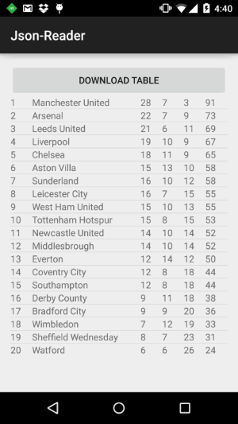

# Using Google Spreadsheets as a Data Source for Your Android App (Part 1)

In this blog post I’ll show you how to use a public Google Spreadsheet as data source in your Android application. 

## Background

Google allows you to treat any public spreadsheet as a table in a database by using the Google Query Language. This language provides an easy way of interrogating a data source and pulling back the results of the query as JSON response or an HTML table.

Normally, you'd access a Google Spreadsheet through a url similar to the one below:
 
https://docs.google.com/spreadsheets/d/**1tJ64Y8hje0ui4ap9U33h3KWwpxT_-JuVMSZzxD2Er8k** (English Premier League Final Table 1999)

If you want to get the same spreadsheet as a JSON response, you'll have to use its key to construct a URL as shown:

https://spreadsheets.google.com/tq?key=**1tJ64Y8hje0ui4ap9U33h3KWwpxT_-JuVMSZzxD2Er8k**

[](http://screencast.com/t/mLFPhtDnRxw)

As you can see, it is not a ready-to-use JSON and a little bit of work is necessary to make it compatible with org.json.JSONObject. Nevertheless, once the unnecessary parts are trimmed, you’re left with a JSON object that contains all the rows and columns of the spreadsheet.

In addition, the Google Query Language offers server side filtering through SQL-like statements but that would be covered in another post.

## Downloading a Google Spreadsheet

Network operations are unpredictable and can cause poor user experience. Therefore, it’s a good development practice to perform network operations on a separate thread from the UI. 

The AsyncTask class provides a way to do that by exposing two important methods:

* doInBackground() does all the work around downloading a web page content as a string. When it’s done, it passes the result to onPostExecute.
* onPostExecute() takes the returned string and displays it in the UI.

Following is the class I use to download the contents of a Google Spreadsheet.

```
import android.os.AsyncTask;
import org.json.JSONException;
import org.json.JSONObject;
import java.io.BufferedReader;
import java.io.IOException;
import java.io.InputStream;
import java.io.InputStreamReader;
import java.net.HttpURLConnection;
import java.net.URL;
public class DownloadWebpageTask extends AsyncTask<String, Void, String> {
    AsyncResult callback;
    public DownloadWebpageTask(AsyncResult callback) {
        this.callback = callback;
    }
    @Override
    protected String doInBackground(String... urls) {
        // params comes from the execute() call: params[0] is the url.
        try {
            return downloadUrl(urls[0]);
        } catch (IOException e) {
            return "Unable to download the requested page.";
        }
    }
    // onPostExecute displays the results of the AsyncTask.
    @Override
    protected void onPostExecute(String result) {
        // remove the unnecessary parts from the response and construct a JSON
        int start = result.indexOf("{", result.indexOf("{") + 1);
        int end = result.lastIndexOf("}");
        String jsonResponse = result.substring(start, end);
        try {
            JSONObject table = new JSONObject(jsonResponse);
            callback.onResult(table);
        } catch (JSONException e) {
            e.printStackTrace();
        }
    }
    private String downloadUrl(String urlString) throws IOException {
        InputStream is = null;
        try {
            URL url = new URL(urlString);
            HttpURLConnection conn = (HttpURLConnection) url.openConnection();
            conn.setReadTimeout(10000 /* milliseconds */);
            conn.setConnectTimeout(15000 /* milliseconds */);
            conn.setRequestMethod("GET");
            conn.setDoInput(true);
            // Starts the query
            conn.connect();
            int responseCode = conn.getResponseCode();
            is = conn.getInputStream();
            String contentAsString = convertStreamToString(is);
            return contentAsString;
        } finally {
            if (is != null) {
                is.close();
            }
        }
    }
    private String convertStreamToString(InputStream is) {
        BufferedReader reader = new BufferedReader(new InputStreamReader(is));
        StringBuilder sb = new StringBuilder();
        String line = null;
        try {
            while ((line = reader.readLine()) != null) {
                sb.append(line + "\n");
            }
        } catch (IOException e) {
            e.printStackTrace();
        } finally {
            try {
                is.close();
            } catch (IOException e) {
                e.printStackTrace();
            }
        }
        return sb.toString();
    }
}
```

## Constructing a JSON object

Once the JSON string has been downloaded and is in compatible format, it can be used to create a JSONObject.

```
JSONObject jObject = new JSONObject(stringResponse);
```

The JSONObject then can be traversed in order to create the application's ViewModel. For this particular example, I have a class called Team with the following fields:
 
* position
* name
* wins
* draws 
* losses 
* points

The final result can be seen below.



In [Part 2](https://github.com/telerik/Android-samples/tree/master/Blogs/Json-Reader-2) you can see how to execute SQL-like queries against the server thus limiting the number of results that are being returned.

[](http://www.telerik.com/download/android-ui)